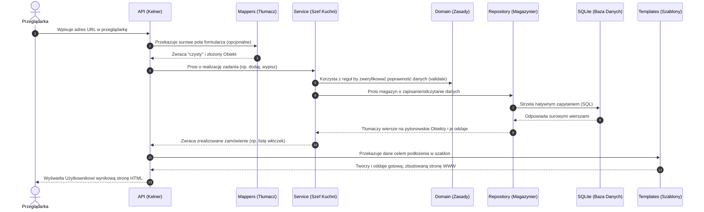

# Warstwy aplikacji w what-a-knit

## Ogólny schemat

Aplikacja jest podzielona na warstwy — każda ma swoją odpowiedzialność.
Żądanie "przepływa" przez nie od góry do dołu, a odpowiedź wraca w górę:



### Analogia restauracyjna:
| Warstwa        | Rola            | Co robi                              |
|----------------|-----------------|--------------------------------------|
| **API**        | Kelner          | Przyjmuje zamówienie, przynosi danie |
| **Service**    | Szef kuchni     | Decyduje JAK przygotować zamówienie  |
| **Repository** | Magazynier      | Przynosi składniki z magazynu (bazy) |

---

## API (`api.py`) — warstwa HTTP / Flaska

API to **plik z route'ami**. To jedyne miejsce, które "wie" o Flasku.

```python
@yarn_api.get('')
def index():
    yarns = service.get_all_yarns()    # poproś service o dane
    return render_template('yarn/index.html', yarns=yarns)  # wyślij do szablonu
```

### Co robi API:
- Odbiera żądanie od przeglądarki (route)
- Prosi Service o dane lub wykonanie akcji
- Przekazuje wynik do szablonu HTML
- Zwraca odpowiedź do przeglądarki

### Rzeczy z Flaska, które widzisz TYLKO w api.py:
- `Blueprint` — tworzenie modułu
- `@yarn_api.get(...)` / `@yarn_api.post(...)` — route'y
- `render_template(...)` — renderowanie szablonu
- `request` — dane z formularza
- `redirect(...)` — przekierowanie na inny adres

### `.get()` vs `.post()` — skróty
```python
@yarn_api.route('/yarn', methods=['GET'])   # długa wersja
@yarn_api.get('/yarn')                       # skrót — to samo!

@yarn_api.route('/yarn/add', methods=['POST'])  # długa wersja
@yarn_api.post('/yarn/add')                      # skrót — to samo!
```

Przypomnienie:
- **GET** = "daj mi tę stronę" (wejście na adres w przeglądarce)
- **POST** = "wysyłam Ci dane" (kliknięcie "Zapisz" w formularzu)

---

## Service (`service.py`) — logika biznesowa

Service to **"mózg" modułu**. Wie jakie są reguły i pilnuje ich.

```python
class YarnService:
    def get_all_yarns(self) -> list[Yarn]:
        return self._yarn_repo.get_all()     # prosty przypadek — przekaż dalej

    def add_yarn(self, yarn: Yarn) -> Yarn:
        yarn.validate()                      # sprawdź reguły!
        return self._yarn_repo.add(yarn)     # dopiero potem zapisz

    def delete_yarn(self, yarn_id: YarnId) -> None:
        self.get_yarn(yarn_id)               # sprawdź czy istnieje
        skeins = self._skein_repo.get_by_yarn_id(yarn_id)
        for skein in skeins:
            self._skein_repo.delete(skein.id)  # usuń powiązane motki
        self._yarn_repo.delete(yarn_id)        # dopiero teraz usuń włóczkę
```

### Co robi Service:
- Pilnuje reguł biznesowych (walidacja, kolejność operacji)
- Koordynuje pracę — może korzystać z wielu repozytoriów
- NIE wie nic o Flasku, HTML, przeglądarce
- NIE rozmawia bezpośrednio z bazą danych

### Co to jest "logika biznesowa"?

"Biznes" = temat/dziedzina aplikacji (tu: dziewiarstwo), NIE firma/pieniądze.

**Logika biznesowa = reguły Twojego tematu:**
- "Nie można dodać włóczki bez nazwy"
- "Usuwając włóczkę, usuń też jej motki"
- "Motek nie może ważyć więcej niż cała włóczka"

Te reguły byłyby prawdziwe nawet bez komputera — gdybyś prowadziła
sklep z włóczkami na papierze.

**Co NIE jest logiką biznesową:**
- "Wyświetl stronę HTML" → to logika prezentacji (API)
- "Zapisz wiersz w SQL" → to logika dostępu do danych (Repository)
- "Przycisk ma być fioletowy" → to logika wyglądu (CSS)

---

## Repository — dostęp do bazy danych

**Repository to "tłumacz" między bazą danych a Pythonem.**

Baza danych z natury operuje na wierszach i kolumnach (jak w Excelu) i rozmawia w języku **SQL**. Z kolei reszta aplikacji (Service, API) woli korzystać z ładnych obiektów Pythona (np. klasy `Yarn`), które mają własne metody i typy.

Repository zajmuje się tym, by obie strony się zrozumiały i żeby Service nie musiał pisać zapytań SQL.

### 1. Pobieranie z bazy (`get_all`, `get_by_id`)
Pyta bazę, używając SQL, następnie zamienia pobrane wiersze (surowe dane) na pełne obiekty:

```python
def get_all(self) -> list[Yarn]:
    db = get_db()                           # Otwórz połączenie
    
    # 1. Wysyłasz pytanie (SQL) do bazy
    cursor = db.execute('SELECT * FROM yarn')
    
    # 2. Odbierasz wszystkie wyniki z byciem gotowym na ich przerobienie
    rows = cursor.fetchall()
    
    # 3. Zamieniasz je ("tłumaczysz") na obiekty
    yarns = []
    for row in rows:
        d = dict(row)             # zamień na słownik: {'id': 1, 'name': 'Alpaca', ...}
        yarn_row = YarnRow(**d)   # "rozpakuj" z dwoma gwiazdkami! To co poniżej.
        # ... proces tworzenia obiektu ...
        yarns.append(yarn)
        
    return yarns
```

#### Przydatne zwroty i komendy:
- `db.execute(...)` — jak wysłanie zapytania. Zwraca kursor, czyli "pilot" do wyników.
- `cursor.fetchall()` — każe kursorowi pobrać z bazy **wszystkie** odebrane wiersze.
- `cursor.fetchone()` — używane przy np. `get_by_id` gdzie zależy nam na **jednym** lub żadnym wierszu. Gdy brak wyników, zwraca `None`.
- `**d` (rozpakowywanie słownika) — zamienia słownik na nazwane argumenty do funkcji. Przykład: mając `d = {'id': 1, 'name': 'A'}`, zapis `YarnRow(**d)` działa identycznie jak napisanie `YarnRow(id=1, name='A')`. Magia Pythona!

### 2. Pisanie do bazy (`add`, itp.)
Gdy chcemy dodać obiekt (nową włóczkę), wyciągamy z niego wartości i układamy w polecenie `INSERT`.

```python
def add(self, yarn: Yarn) -> Yarn:
    db = get_db()
    
    # "INSERT INTO ... VALUES (?, ?)" to wklejanie nowego wiersza.
    # Znaki zapytania '?' to placeholdery (bezpieczne pola) uzupełniane danymi z obiektu:
    cursor = db.execute(
        '''INSERT INTO yarn (brand, name) VALUES (?, ?)''',
        (yarn.brand, yarn.name)
    )
    
    db.commit()   # BARDZO WAŻNE: zatwierdź zmiany (jak przycisk Zapisz w Wordzie)!
    
    yarn.id = YarnId(cursor.lastrowid)   # Baza sama przyznała jej numer ID, możemy go przejąć
    
    return yarn
```

---

## Domain (`domain.py`) — modele i czysta logika

Domain (Domena) to zdefiniowanie **co** w ogóle istnieje w Twojej aplikacji. Tu mówisz Pythonowi: *"Są w naszym świecie takie rzeczy jak Włóczka, są Motki, a włóczki mają konkretne Składy"*.

W domenie tworzymy tzw. **Modele** (klasy danych), z których korzystają potem pozostali (Service, Mappers, itp.):

```python
class Yarn:
    id: Optional[YarnId]
    brand: str
    name: str
    full_weight: Mass
    # ...
    
    def validate(self) -> None:
        # np. reguła: czy skład ułamkowy daje poprawne 100% obwodu
        ...
```

To tutaj mieści się **najczystsza logika biznesowa**, bo obiekty potrafią "same o sobie pomyśleć" przy wywołaniu metody `validate()` i samodzielnie sprawdzić własne właściwości (np. czy waga motka nie przekracza pełnej wagi włóczki).

### `dataclass` i pusta lista jako domyślna wartość

Przy `@dataclass` trzeba uważać na **mutowalne** wartości domyślne, np.:
- listy `[]`
- słowniki `{}`

Ten zapis wygląda niewinnie:

```python
from dataclasses import dataclass

@dataclass
class Project:
    patterns: list[int] = []
```

ale jest błędny.

### Dlaczego?

Bo lista jest mutowalna, czyli można ją później zmieniać (`append`, `remove`, itd.).
Gdyby taka lista była wpisana jako zwykły default, różne obiekty mogłyby współdzielić tę samą jedną listę.

Czyli mogłaby się wydarzyć niebezpieczna sytuacja:
- tworzysz `project_a`
- tworzysz `project_b`
- dodajesz pattern do `project_a.patterns`
- a potem okazuje się, że `project_b.patterns` też się zmieniło

Dlatego `dataclass` każe użyć `field(default_factory=...)`.

Poprawny zapis:

```python
from dataclasses import dataclass, field

@dataclass
class Project:
    patterns: list[int] = field(default_factory=list)
```

### Co robi `default_factory=list`?

To znaczy:
- nie używaj jednej wspólnej listy dla wszystkich obiektów
- tylko przy tworzeniu każdego nowego obiektu utwórz nową pustą listę

Czyli:
- `Project()` dostaje swoją własną listę
- następny `Project()` dostaje inną, osobną listę

To jest bardzo częsty wzorzec w Pythonie przy `dataclass`.

---

## Mappers (`mappers.py`) — tłumacz formularzy HTML na obiekty

Gdy użytkownik wysyła formularz ze strony, **Flask w API** dobiera się do obiektu `request.form` wypluwając wszystko jako surowe teksty.

Mappers to po prostu "tłumacz z HTML/HTTP do świata Pythona" by API zachowało czystość kodu.

```python
def parse_yarn_from_form() -> Yarn:
    return Yarn(
        brand=request.form['brand'],  # formularz HTML w wysłanej formie ma znacznik name="brand"
        
        # '50' z formularza z tekstu (str) przebija się na liczbę (int) a potem upiększa do wagi Mass()!
        full_weight=Mass(int(request.form['full_weight'])),
        # ...
    )
```

**Zasada:** Zamiast rzeźbić w plikach API na około używając rzutów `int()` etc, używamy dedykowanej funkcji `mappers.py`, która bierze słownik (nieobiektowy brudnopis) z formularza i zwraca nam elegancki, zbudowany obiekt (czystopis) domeny.

---

## Pełny przepływ żądania — przykład GET /yarn

```
1. Przeglądarka wysyła: GET /yarn
2. Flask szuka route'a → yarn_api.index()          [api.py]
3. index() woła: service.get_all_yarns()            [service.py]
4. service woła: self._yarn_repo.get_all()          [repository.py]
5. repository pyta bazę: SELECT * FROM yarn          [baza danych]
6. baza zwraca wiersze → repository zamienia na obiekty Yarn
7. lista Yarn wraca do service → wraca do API
8. API wrzuca do szablonu: render_template('yarn/index.html', yarns=yarns)
9. Jinja2 generuje HTML
10. Flask odsyła gotowy HTML do przeglądarki
```
